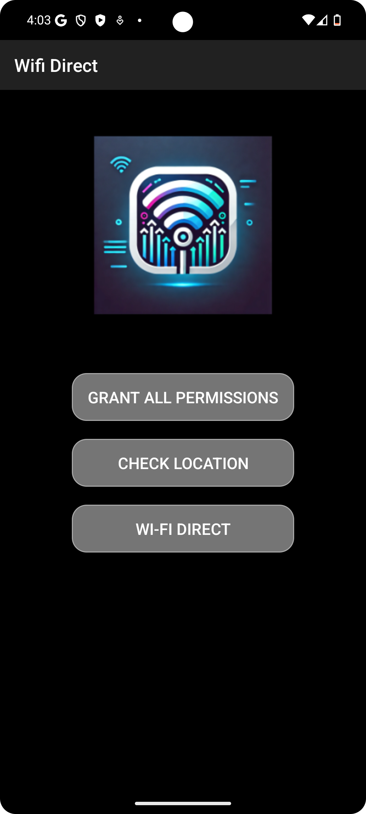

# WiFiDirect File Transfer

A lightweight Android application enabling seamless file sharing and transfer via Wi-Fi Direct. The application supports sending and receiving files between devices, managing trusted devices, and maintaining a transfer history. This is an ideal project for showcasing skills in Android development and network communication.

## Features
- **File Sending and Receiving**: Transfer files over Wi-Fi Direct.
- **Progress Tracking**: Real-time progress bar and percentage display during transfers.
- **Trusted Devices Management**: Save and manage a list of trusted devices for quick connections.
- **Transfer History**: View history of sent and received files.
- **Battery Awareness**: Optimized for low-battery conditions with monitoring.

## Screenshots
(*Add relevant screenshots of your app interface here.*)

---

## Prerequisites
Before running this project, make sure you have the following:
- **Android Studio**: Version 2022.3 or higher.
- **Android SDK**: Minimum API level 21 (Android 5.0 Lollipop).
- A device or emulator with Wi-Fi Direct support.

---

## How to Run the Project

1. **Clone the Repository**:
   ```bash
   git clone https://github.com/dawidolko/WiFiDirect-FileTransfer.git
   
   cd WiFiDirect-FileTransfer
   ```




# Project directory tree structure

```
app/
├── manifests/
│   └── AndroidManifest.xml
├── kotlin+java/
│   └── pl.dawidolko.wifidirect/
│       ├── FileActivity/
│       │   ├── FileReceiverActivity.kt
│       │   ├── FileSenderActivity.kt
│       │   └── IpAddressCallback.kt
│       ├── HistoryActivity/
│       │   ├── HistoryActivity.kt
│       │   ├── HistoryItem.kt
│       │   ├── TransferHistoryAdapter.kt
│       │   └── TransferHistoryManager.kt
│       ├── receivers/
│       │   ├── BatteryBroadcastReceiver.kt
│       │   └── WifiDirectBroadcastReceiver.kt
│       ├── TrustedDevicesActivity/
│       │   ├── TrustedDevice.kt
│       │   ├── TrustedDevicesActivity.kt
│       │   └── TrustedDevicesAdapter.kt
│       └── ui.theme/
│           ├── MainActivity.kt
│           ├── SplashActivity.kt
│           └── WifiDirectActivity.kt
├── res/
│   ├── drawable/
│   │   ├── button_background.xml
│   │   ├── ic_default_p2p.png
│   │   ├── ic_launcher_background.xml
│   │   ├── ic_notification.png
│   │   ├── ic_p2p.xml
│   │   └── logo_high_quality.xml
│   ├── font/
│   │   ├── roboto_bold.ttf
│   │   ├── roboto_italic.ttf
│   │   └── roboto_regular.ttf
│   ├── layout/
│   │   ├── activity_file_receiver.xml
│   │   ├── activity_file_sender.xml
│   │   ├── activity_history.xml
│   │   ├── activity_main.xml
│   │   ├── activity_splash.xml
│   │   ├── activity_trusted_devices.xml
│   │   ├── activity_wifi_direct.xml
│   │   ├── history_item_layout.xml
│   │   ├── item_device.xml
│   │   └── item_trusted_device.xml
│   ├── mipmap/
│   │   ├── ic_launcher/
│   │   ├── ic_launcher_background/
│   │   ├── ic_launcher_foreground/
│   │   └── ic_launcher_round/
│   ├── values/
│   │   ├── colors.xml
│   │   ├── ids.xml
│   │   ├── strings.xml
│   │   ├── styles.xml
│   │   └── themes.xml
│   └── xml/
│       ├── backup_rules.xml
│       └── data_extraction_rules.xml
├── Gradle Scripts/
│   ├── build.gradle.kts (Project: Wifi_Direct)
│   ├── build.gradle.kts (Module: app)
│   ├── proguard-rules.pro
│   ├── gradle.properties
│   ├── gradle-wrapper.properties
│   ├── libs.versions.toml
│   ├── local.properties
│   └── settings.gradle.kts
```
