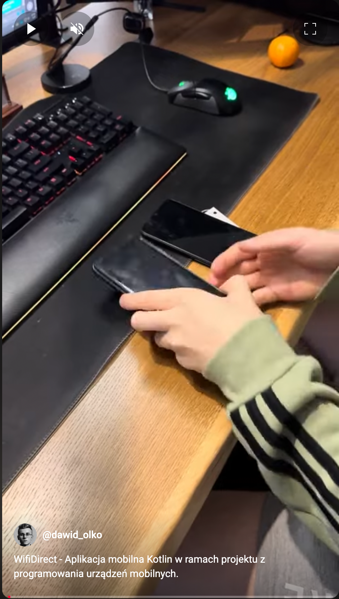
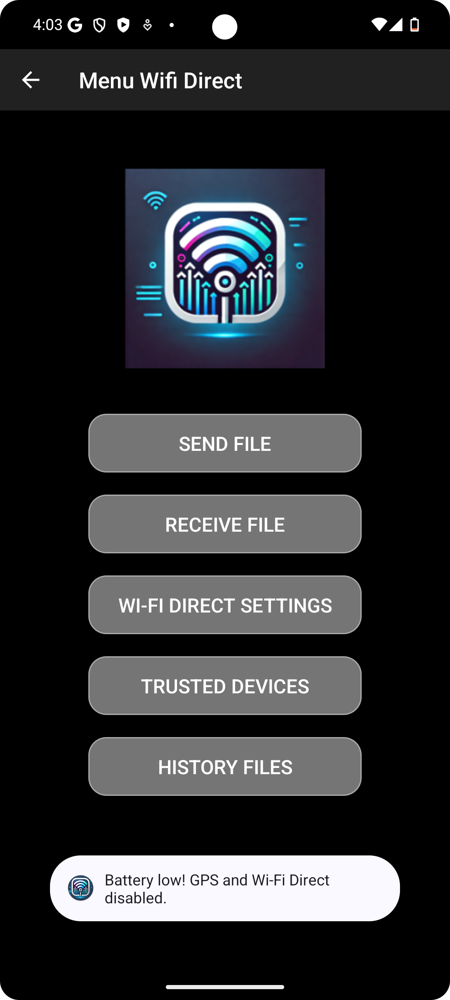
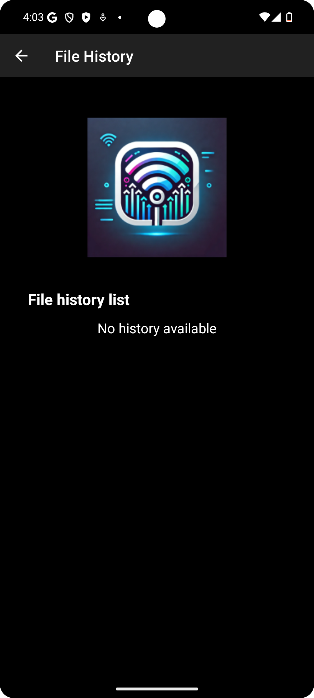
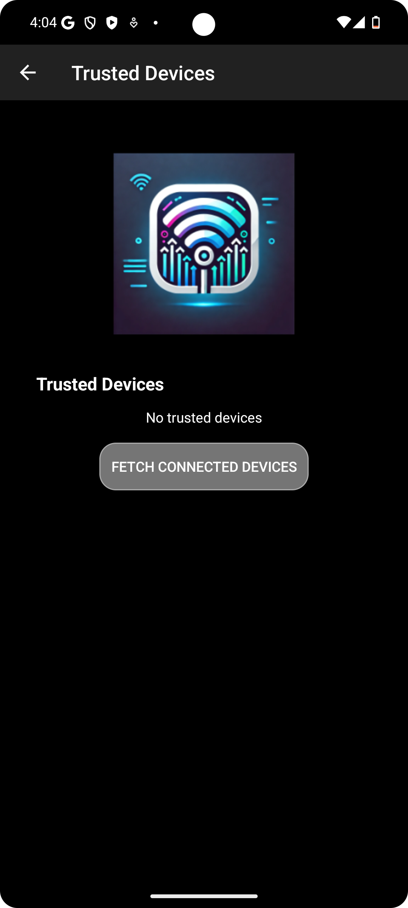
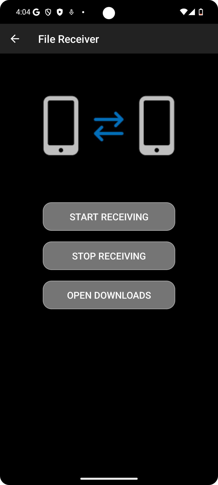
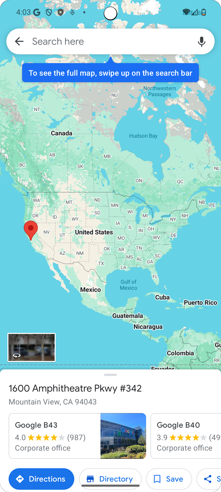
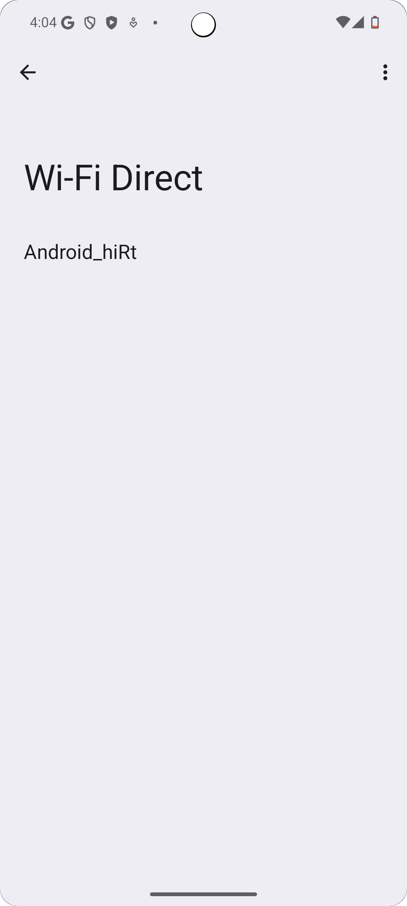

# WiFiDirect-FileTransfer 

> 🚀 **Seamless Android File Sharing via Wi-Fi Direct** - Build lightweight file transfer applications with real-time progress tracking and device management

## 📋 Description

Welcome to the **WiFiDirect File Transfer** repository! This Android application enables seamless file sharing and transfer between devices using Wi-Fi Direct technology. The app features real-time progress tracking, trusted device management, transfer history, and battery-aware optimizations for efficient file transfers without internet connectivity.

This project demonstrates best practices in Android development, including network communication, broadcast receivers, permission handling, and modern Kotlin programming. Perfect for showcasing skills in mobile development and peer-to-peer file transfer implementations.

## 📁 Repository Structure

```

WiFiDirect-FileTransfer/
├── 📁 app/
│ ├── 📄 manifests/
│ │ └── AndroidManifest.xml # App permissions and components
│ ├── 📁 kotlin+java/
│ │ └── pl.dawidolko.wifidirect/
│ │ ├── 📂 FileActivity/
│ │ │ ├── 📤 FileSenderActivity.kt # File sending logic
│ │ │ ├── 📥 FileReceiverActivity.kt # File receiving logic
│ │ │ └── 🔌 IpAddressCallback.kt # Network callbacks
│ │ ├── 📂 HistoryActivity/
│ │ │ ├── 📊 HistoryActivity.kt # Transfer history view
│ │ │ ├── 📝 HistoryItem.kt # History data model
│ │ │ ├── 🔄 TransferHistoryAdapter.kt # RecyclerView adapter
│ │ │ └── 💾 TransferHistoryManager.kt # History persistence
│ │ ├── 📂 receivers/
│ │ │ ├── 🔋 BatteryBroadcastReceiver.kt # Battery monitoring
│ │ │ └── 📡 WifiDirectBroadcastReceiver.kt # Wi-Fi Direct events
│ │ ├── 📂 TrustedDevicesActivity/
│ │ │ ├── 🔐 TrustedDevice.kt # Trusted device model
│ │ │ ├── ⚙️ TrustedDevicesActivity.kt # Device management
│ │ │ └── 📋 TrustedDevicesAdapter.kt # Device list adapter
│ │ └── 📂 ui.theme/
│ │ ├── 🏠 MainActivity.kt # Main entry point
│ │ ├── 🎨 SplashActivity.kt # Splash screen
│ │ └── 📶 WifiDirectActivity.kt # Wi-Fi Direct main UI
│ ├── 📁 res/
│ │ ├── 🎨 drawable/ # Graphics and icons
│ │ ├── 🔤 font/ # Custom fonts (Roboto)
│ │ ├── 📐 layout/ # XML layout files
│ │ ├── 🖼️ mipmap/ # App launcher icons
│ │ ├── ⚙️ values/ # Colors, strings, themes
│ │ └── 📋 xml/ # Backup and extraction rules
│ └── 📁 Gradle Scripts/
│ ├── 📦 build.gradle.kts # Build configuration
│ ├── ⚙️ gradle.properties # Gradle properties
│ └── 🔧 settings.gradle.kts # Project settings
├── 📁 img/ # App screenshots
├── 📁 videos/ # Demo videos
└── 📖 README.md # Project documentation

```

## 🚀 Getting Started

### 1. Clone the Repository

```bash
git clone https://github.com/dawidolko/WiFiDirect-FileTransfer.git
cd WiFiDirect-FileTransfer
```

### 2. Open in Android Studio

```bash
# Open the project in Android Studio
# File -> Open -> Select WiFiDirect-FileTransfer directory
```

### 3. Sync Gradle Dependencies

```bash
# Android Studio will automatically prompt to sync Gradle
# Or manually: File -> Sync Project with Gradle Files
```

### 4. Run the Application

```bash
# Connect an Android device or start an emulator
# Click "Run" button or press Shift+F10
```

- The application will launch on your device at [http://localhost](http://localhost)

## ⚙️ System Requirements

### **Essential Tools:**

- **Android Studio** (version 2022.3 or higher)
- **Android SDK** (minimum API level 21 - Android 5.0 Lollipop)
- **JDK** (Java Development Kit 11 or higher)
- **Git** for version control

### **Development Environment:**

- **Kotlin** (latest stable version)
- **Gradle** build system
- **Android Device** or **Emulator** with Wi-Fi Direct support
- Physical devices recommended for full Wi-Fi Direct testing

### **Device Requirements:**

- **Android 5.0** (API 21) or higher
- **Wi-Fi Direct** hardware support
- **Location permissions** for Wi-Fi Direct peer discovery
- **Storage permissions** for file access

### **Recommended Android Studio Plugins:**

- **Kotlin** language support
- **Android Lint** for code quality
- **ADB Idea** for device management
- **Git Integration** for version control

## ✨ Key Features

### **📤 File Transfer System**

- Send and receive files over Wi-Fi Direct connection
- Support for multiple file types and sizes
- Real-time progress tracking with percentage display
- Automatic connection management and error handling

### **📊 Transfer Monitoring**

- Live progress bar during file transfers
- Transfer speed calculation and display
- Success/failure notifications
- Detailed transfer status updates

### **🔐 Trusted Devices Management**

- Save frequently used devices for quick connections
- Manage list of trusted devices with add/remove functionality
- Automatic device recognition and connection
- Secure device pairing and authentication

### **📜 Transfer History**

- Complete history of sent and received files
- Detailed transfer information (file name, size, date, status)
- Search and filter capabilities
- History persistence across app sessions

### **🔋 Battery Optimization**

- Battery level monitoring during transfers
- Low-battery warnings and transfer management
- Optimized power consumption for extended usage
- Automatic transfer pause on critical battery levels

### **📱 Modern Android UI**

- Material Design principles and components
- Custom fonts (Roboto) for consistent typography
- Intuitive navigation and user experience
- Responsive layouts for various screen sizes

## 🛠️ Technologies Used

- **Kotlin** - Modern Android development language
- **Android SDK** - Core Android framework and APIs
- **Wi-Fi Direct (Wi-Fi P2P)** - Peer-to-peer connectivity
- **Broadcast Receivers** - System event handling
- **RecyclerView** - Efficient list rendering
- **SharedPreferences** - Local data persistence
- **Material Design Components** - Modern UI elements
- **Gradle** - Build automation and dependency management

## 🌍 Live Demo

Watch the application in action on YouTube:

[](https://youtube.com/shorts/CwdRK33g_8U?feature=share)

Or view the [local demo video](videos/ApplicationTest.mp4)

## 🖼️ Preview

### Main Menu

[](img/img1.png)

### Wi-Fi Direct Connection

[](img/img2.png)

### Transfer History

[](img/img3.png)

### Trusted Devices

[](img/img4.png)

### File Receiver Interface

[](img/img5.png)

### Location Permissions

[](img/img7.png)

### Wi-Fi Direct Settings

[](img/img8.png)

## 🤝 Contributing

Contributions are highly welcomed! Here's how you can help:

- 🐛 **Report bugs** - Found an issue? Let us know!
- 💡 **Suggest improvements** - Have ideas for better features?
- 🔧 **Submit pull requests** - Share your enhancements and solutions
- 📖 **Improve documentation** - Help make the project clearer

Feel free to open issues or reach out through GitHub for any questions or suggestions.

## 👨‍💻 Author

Created by **Dawid Olko** - Part of the Android mobile development series.

## 📄 License

This project is open source and available under the [MIT License](LICENSE).

---
