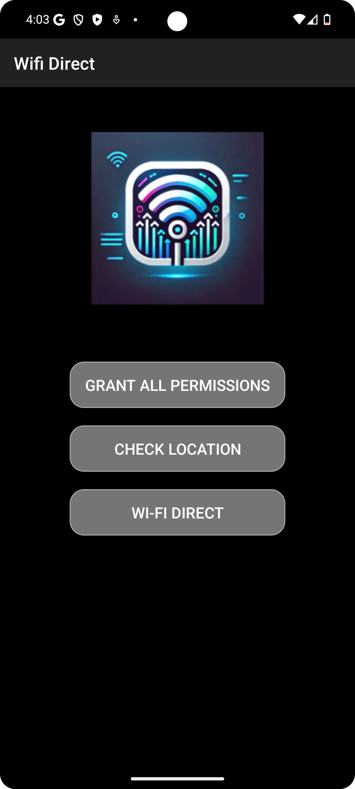
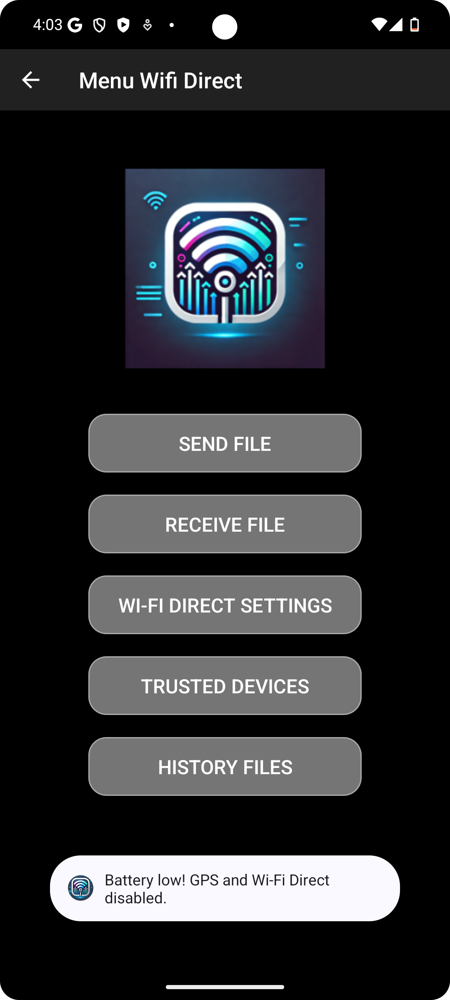
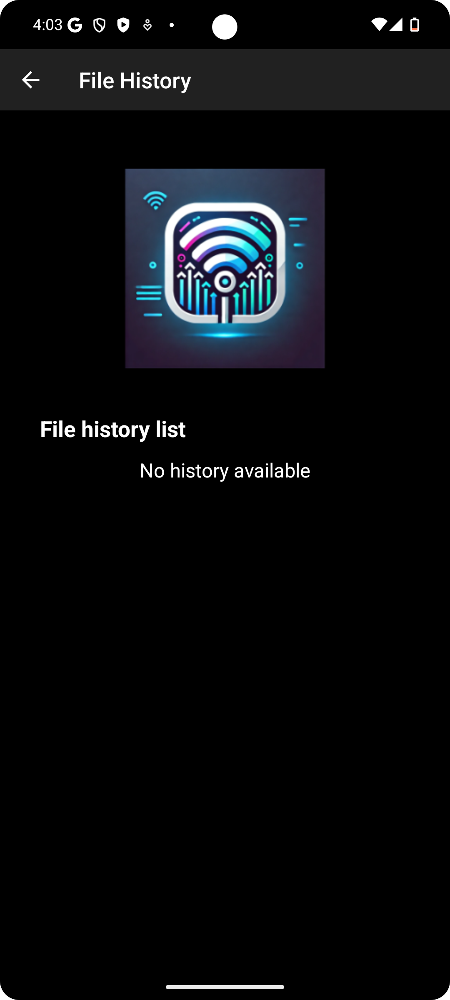
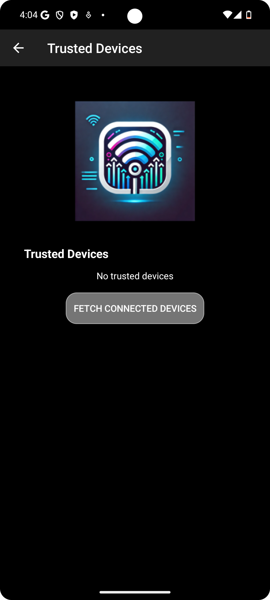
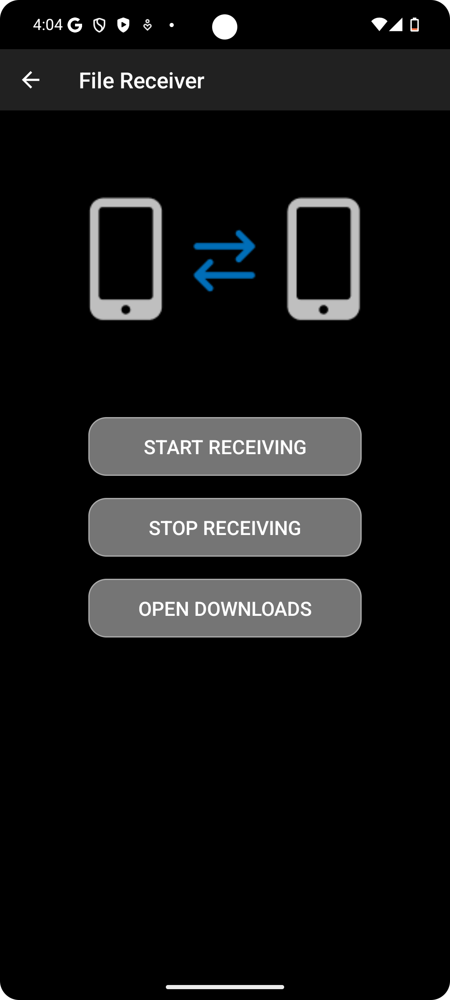
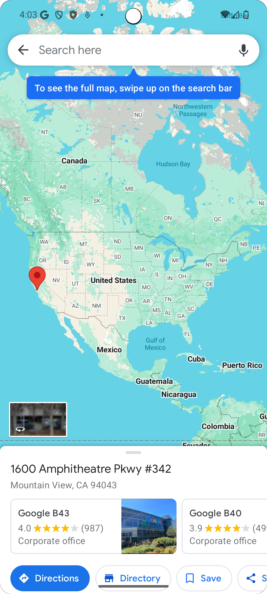

# WiFiDirect File Transfer

> 📱 **Two phones, no network** — an Android app that sends files over Wi-Fi Direct, with no router, no account and no cloud in between

**WiFiDirect File Transfer** moves files straight between two Android devices. Wi-Fi Direct negotiates the link, one device becomes the sender and the other the receiver, and the bytes go over a socket between them. Nothing is uploaded, nothing passes through a server, and the two phones do not need to be on the same network — or on any network at all.

Around the transfer itself sit the things that make it usable twice: a history of what was sent where, a list of trusted devices so a familiar phone need not be re-identified, and a battery receiver that warns before a long transfer starts on a nearly flat device.


**Demo:** [watch on YouTube](https://youtube.com/shorts/CwdRK33g_8U?feature=share) · [local recording](videos/ApplicationTest.mp4)

---

## 🎯 Key Features

- **Peer-to-peer, not cloud** — Wi-Fi Direct forms the link and a socket carries the file. No router, no internet connection and no third party holding the data.
- **Sender and receiver are separate screens** — `FileSenderActivity` and `FileReceiverActivity` each handle their own half of the exchange, including the IP address callback that pairs them.
- **Transfer history** — `TransferHistoryManager` records what went where, so the app can answer "did that actually send?" after the fact.
- **Trusted devices** — a device can be remembered, so a phone you send to every day is not a fresh discovery every time.
- **Battery awareness** — a broadcast receiver watches the level, because a large transfer that dies halfway is worse than one that never starts.
- **Permissions handled explicitly** — Wi-Fi Direct discovery needs location access on Android; the app asks for it and explains why rather than failing silently.
- **A splash screen and a themed UI** — Compose theming (`Color.kt`, `Theme.kt`, `Type.kt`) keeps the look consistent across activities.
- **Two builds included** — `app-debug.apk` and `app-release.apk` are in the repository, so the app can be tried without a toolchain.

---

## 🖼️ Screenshots

| Main menu                                   | Wi-Fi Direct connection                      | Transfer history                            |
| ------------------------------------------- | -------------------------------------------- | ------------------------------------------- |
| [](img/img1.png) | [](img/img2.png) | [](img/img3.png) |

| Trusted devices                             | File receiver                                | Location permission                          |
| ------------------------------------------- | -------------------------------------------- | -------------------------------------------- |
| [](img/img4.png) | [](img/img5.png) | [](img/img7.png) |

---

## 🧩 How a Transfer Works

```
Device A                                    Device B
  │  discover peers (Wi-Fi Direct)             │
  │ ─────────────────────────────────────────▶ │
  │  connect — one side becomes group owner    │
  │ ◀───────────────────────────────────────── │
  │  receiver reports its IP (IpAddressCallback)
  │ ◀───────────────────────────────────────── │
  │  file sent over a socket                   │
  │ ─────────────────────────────────────────▶ │
  │  both write the result into history        │
```

The group owner's address is what the sender needs, which is why the callback exists: without it the sender would have no idea where to open the socket.

---

## 🛠️ Technology Stack

| Technology            | Role                                                        |
| --------------------- | ----------------------------------------------------------- |
| **Kotlin**            | Application language.                                        |
| **Android Wi-Fi P2P** | Peer discovery, connection and group ownership.              |
| **Sockets**           | The file transfer itself.                                    |
| **BroadcastReceiver** | Wi-Fi Direct state changes and battery level.                |
| **Jetpack Compose**   | Theme (colours, typography) shared across the activities.    |
| **Gradle (KTS)**      | Build configuration.                                         |

---

## 🚀 Getting Started

### Try the build

Install `app-release.apk` on two Android devices (Android 6.0 or newer, Wi-Fi Direct supported). Enable Wi-Fi and grant location permission on both.

### Build it yourself

```bash
git clone https://github.com/dawidolko/WiFiDirectFileTransfer-Kotlin.git
cd WiFiDirectFileTransfer-Kotlin/WifiDirect

./gradlew assembleDebug          # build
./gradlew installDebug           # install on a connected device
```

Or open the `WifiDirect/` directory in Android Studio and run it on a physical device — Wi-Fi Direct is not available in the emulator.

---

## 📁 Project Structure

```
WiFiDirectFileTransfer-Kotlin/
├── WifiDirect/                       # the application
│   └── app/src/main/java/pl/dawidolko/wifidirect/
│       ├── SplashActivity.kt         # entry screen
│       ├── MainActivity.kt           # menu
│       ├── WifiDirectActivity.kt     # discovery and connection
│       ├── FileActivity/
│       │   ├── FileSenderActivity.kt    # sending half
│       │   ├── FileReceiverActivity.kt  # receiving half
│       │   └── IpAddressCallback.kt     # how the sender learns where to connect
│       ├── HistoryActivity/          # history screen, adapter, manager
│       ├── TrustedDevicesActivity/   # remembered devices
│       ├── receivers/                # battery level receiver
│       └── ui/theme/                 # Compose colours, theme, typography
├── WifiP2P/                          # reference implementation studied while building
├── app-debug.apk / app-release.apk   # ready-to-install builds
├── img/                              # interface screenshots
└── videos/                           # demo recording
```

---

## 📄 License

MIT © [Dawid Olko](https://dawidolko.pl)
